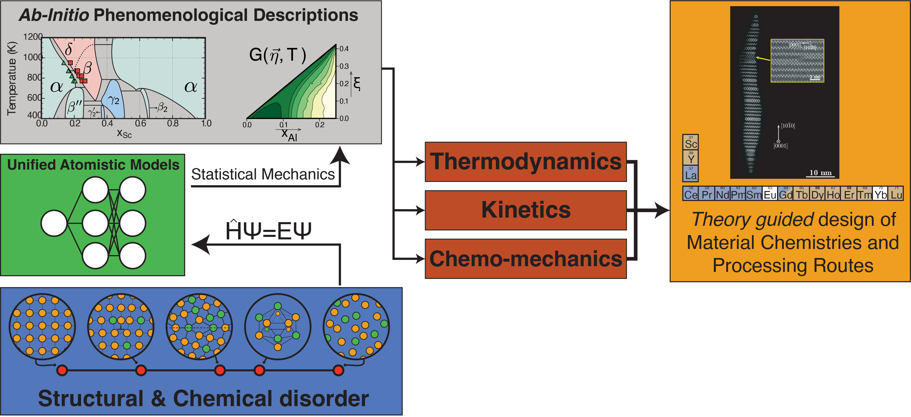

# Laboratory of materials design and simulation (MADES)

 

The Laboratory of Materials Design and Simulation (MADES) is part of the <a href=''>Institute of Materials</a> within the School of Engineering at École Polytechnique Fédérale de Lausanne. The laboratory is led by <a href='https://people.epfl.ch/anirudh.natarajan'>Prof.Anirudh Raju Natarajan</a> 

We develop first-principles phenomenological models of materials with the goal of understanding and designing novel materials, and processing techniques.

The website is based on the [`al-folio`](https://github.com/alshedivat/al-folio) theme powered by `Jekyll`
